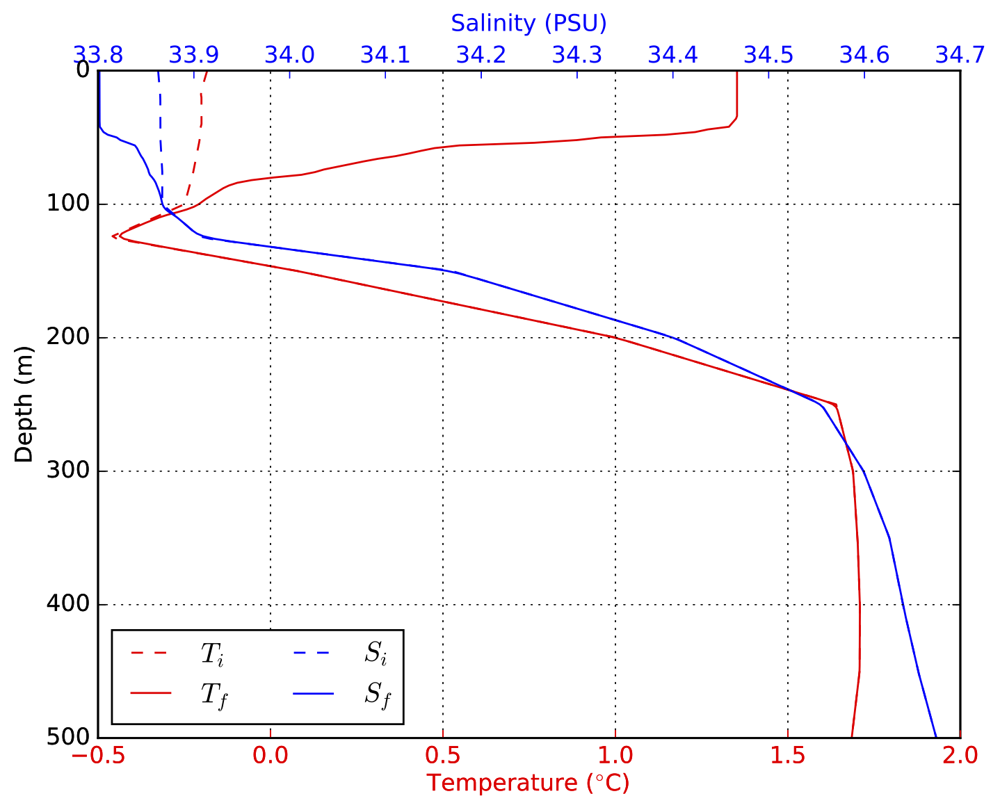
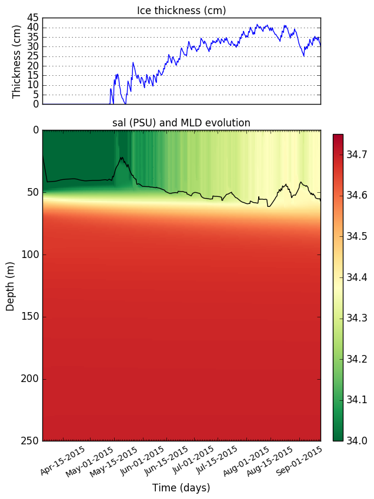

**Disclaimer: I did this re-write as a personal exercise and I am still experimenting with the code. I would recommend thoroughly examining this code before adopting it for your personal use.** 


# Description

This is a Python implementation of the Price Weller Pinkel (PWP) ocean mixed layer model. This code is based on the MATLAB verision of the PWP model, originally written by [Peter Lazarevich and Scott Stoermer](http://www.po.gso.uri.edu/rafos/research/pwp/) (U. Rhode Island) and later modified by Byron Kilbourne (University of Washington) and Sarah Dewey (University of Washington).

For a detailed description of the theory behind the model, see the original [Price et al. (1986)](http://onlinelibrary.wiley.com/doi/10.1029/JC091iC07p08411/full) paper. A much shorter review of the algorithm is provided in the [HYCOM documentation for the PWP](https://hycom.org/attachments/067_pwp.pdf); a google search may yield produce better sources.

The code presented here is functionally similar to its MATLAB equivalent (see *matlab_files/PWP_Byron.m*), but I have made significant changes to the code organization and flow. One big difference is that this code is split into two files: **PWP.py** and **PWP_helper.py**. 

*PWP.py* contains the core numerical algorithms for the PWP model and is mostly a line-by-line translation of the original MATLAB code. 

*PWP_helper.py* contains helper functions to facilitate model initialization, output analysis and other miscellaneous tasks. Many of these functions were introduced in this implementation.

Additionally, this code contains a basic thermodynamic sea-ice model *PWP_ice.py* to deal with scenarios when the surface temperature is cooled past the freezing point of seawater.

# Required modules/libraries
To run this code, you'll need Python 3 and the following libraries:

+ Numpy
+ Scipy
+ Matplotlib
+ xarray
+ seawater

The first three modules are available with the popular python distributions such as [Anaconda](https://www.continuum.io/downloads) and [Canopy](https://store.enthought.com/downloads/#default). You can get the other two modules via the `pip install` command from the unix command line:

```
pip install xarray
pip install seawater
```

Besides the python libraries listed here, this repository should have everything you need to do a model run with the provided datasets.


# PWP ocean model

### Basic overview

With the most basic set-up (i.e. one that uses prescribed surface fluxes and never calls the ice-model), the order of operations is as follows:

1. Set and derive model parameters. (See *set\_params* function in *PWP\_helper.py*). 
2. Prepare forcing and profile data for model run (see *prep\_data* function in *PWP\_helper.py*).
3. Iterate the PWP model:
    + apply heat and E-P fluxes.
    + apply wind stress (momentum flux).
    + apply drag associated with internal wave dissipation.
    + apply bulk Richardson mixing.
    + apply gradient Richardson mixing. 
    + apply diapycnal diffusion.
4. Save results to output file.
5. Make simple plots to visualize the results. 


Examples of how to set-up and execute PWP runs are demonstrated in the `demo1()` and `demo2()` in `PWP_helper.py`. 

### Input data
The PWP model requires *two input files*: one for the surface forcing and another for the initial profile - both files are expected to be netCDF. By default, the code simply applies the prescribed heat and surface to the T-S profile. With this configuration, the following data must be included in the surface forcing file:

+ **time**: time (fraction of day).
+ **sw**: net shortwave radiation (W/m<sup>2</sup>)
+ **lw**: net longwave radiation (W/m<sup>2</sup>)
+ **qlat**: latent heat flux (W/m<sup>2</sup>)
+ **qsens**: sensible heat flux (W/m<sup>2</sup>)
+ **tx**: eastward wind stress (N/m<sup>2</sup>)
+ **ty**: northward wind stress (N/m<sup>2</sup>)
+ **precip**: precipitation rate (m/s)

All are expected to be 1-D arrays of the same length. For the heat fluxes, **positive values should correspond to heat gained by the ocean**. Note that the MATLAB version of this code uses a opposite sign convention. 

The time data field should contain a 1-D array representing fraction of day. For example, for 6 hourly data, this should be a number series that increases in steps of 0.25, such as np.array([1.0, 1.25, 1.75, 2.0, 2.25...]).

The initial profile file should have the following data fields:
 
+ **z**: 1-D array of depth levels (m) 
+ **t**: 1-D array containing temperature profile (degrees celsius)
+ **s**: 1-D array containing salinity profile (PSU) 
+ **lat**: float representing latitude of profile

Examples of both input files are provided in the input directory.


### Run configurations

The `set_params()` function in *PWP_helper.py* provide many options for configuring a model run. Some important default settings are listed below:

+ **dt**: time-step increment in units of hours [3 hours]
+ **dz**: depth increment (meters). [1m]
+ **max_depth**: Max depth of vertical coordinate (meters). [100]
+ **mld_thresh**: Density criterion for MLD (kg/m3). [1e-4]
+ **dt_save**: time-step increment for saving to file (multiples of dt). [1]
+ **winds_ON**: toggle switch for wind forcing. [True]
+ **emp_ON**: toggle switch for freshwater forcing. [True]
+ **drag_ON**: toggle switch for current drag due to internal-inertial wave dispersion. [True]
+ **ice_ON**: toggle switch to allow sea-ice formation is surface layer temperature drops below freezing. [True]
+ **rkz**: vertical diffusivity coefficient (m**2/s). [0.]
+ **dens_option**: density option: 'dens0', 'pdens' or 'dens'. ['dens0']

These default settings can be changed using the `param_kwds` option in `run_PWP`. This is demonstrated in the example that follows.

For the density option, 'dens0' calls `dens0()` from the `seawater` module which computes density assuming all pressures are 0 db. In other words, this option ignores all pressure effects on density. Specifying 'pdens' calls `pden()` from the seawater module and computes potential density referenced to the surface. Specifying 'dens' calls `dens()` from the seawater module and computes density using the full density equation.

**NOTE**: The default 'dens0' setting is the fastest option but it may not be diserable when working with weakly stratified water columns. In such scenarios, 'pdens' or 'dens' may be more appropriate.

### Test case 1: Southern Ocean in the summer
This test case uses data from the default input files, *SO\_met\_30day.nc* and *SO\_profile1.nc*. The *SO\_met\_30day.nc* file contains 6-hourly [NCEP reanalysis surface fluxes](http://www.esrl.noaa.gov/psd/data/gridded/data.ncep.reanalysis.surfaceflux.html) at -53.5 N and 0.02 E, which is situated in the Atlantic sector of the Southern Ocean - just north of the winter ice-edge. The *SO_profile1.nc* file contains temperature and salinity profile data at the above location, collected on December 11, 2014. This data is the the first profile from Argo float [5904469](http://www.ifremer.fr/co-argoFloats/float?detail=false&ptfCode=5904469).

The surface forcing time series are shown below.


For this model run, we set the vertical diffusivity to 1x10<sup>-6</sup> m<sup>2</sup>/s, and change the max depth and depth increment to 500m and 2m, respectively:

```
forcing_fname = 'SO_met_30day.nc'
prof_fname = 'SO_profile1.nc'
p={}
p['rkz']=1e-6
p['dz'] = 2.0 
p['max_depth'] = 500.0 
forcing, pwp_out = PWP_helper.run_PWP(met_data=forcing_fname, prof_data=prof_fname, save_plots=True, param_kwds=p)
```

The results are displayed below.    



You can repeat this test case by running the `run_demo2()` function in *PWP_helper.py*.


### Runs with computed heat fluxes

The PWP code can also compute heat fluxes using bulk formula. These computations are done in `get_atm_ocean_HF()` in *PWP.py*. To exercise this option, set `use_Bulk_Formula = True` in `set_params()` or via the `param_mods` argument in `run_PWP` as demonstrated earlier. Additionally, include the following atmospheric state variables in the forcing file:

+ **dlw**: downwelling longwave radiation (W/m<sup>2</sup>)
+ **u10m**: zonal winds at 10m (m/s)
+ **v10m**: meridonial winds at 10m (m/s)
+ **shum2m**: specific humidity at 2m (kg/kg)
+ **atemp2m**: temperature at 2m (K)

Currently, the code is only able to compute *sensible heat*, *latent heat* and *upward longwave radiation*. This is done at beginning of every time step using the atmospheric state variables listed above plus the model derived SST. 

The turbulent heat fluxes are computed using the procedure outlined in [Large and Yeager 2009](https://link.springer.com/article/10.1007/s00382-008-0441-3) without any height adjustment to the temperature and humidity fields. The upward longwave heat flux is computed using Boltzman's law $ulw=\epsilon \sigma T^4$, where $\epsilon=1$ is the emissivity. The computed upward longwave flux is combined with the prescribed downwelling longwave flux to produce net longwave radiation.

When this option is set, the ice-atmosphere heat fluxes are also computed in a similar fashion. This is done in `get_atm_ice_HF()` in *PWP.py*.

# Thermodynamic Sea-Ice Model

If `params[ice_ON]=True` the PWP model, the PWP model is able to generate sea-ice. The algorithms for generating sea-ice are located in *PWP_ice.py* file. When sea-ice is generated, the iteration step of the PWP model becomes:

3. Iterate the PWP model:
    + _if sea-ice exists_, compute ocean-ice heat flux, evolve sea-ice and apply sea-ice salinity flux.
    + _if sea-ice does not exist_, apply heat flux to surface ocean and create sea-ice if necessary.
    + apply E-P fluxes.
    + apply wind stress (momentum flux).
    + apply drag associated with internal wave dissipation.
    + apply bulk Richardson mixing.
    + apply gradient Richardson mixing. 
    + apply diapycnal diffusion. 

Currently, the ice-model is purely thermodynamic and does not affect the way wind stress is applied to the ocean. In other words, the model tacitly assumes that the wind momentum is transferred through the sea-ice without any loss - a somewhat reasonable assumption when considering free-drift conditions.


###Creating initial sea ice
The `create_initial_ice()` is called when the temperature of top layer of the PWP model first dips below the freezing point. This function resets the temperature of the top layer to the freezing point of seawater then converts the "excess cooling" into ice. The appropriate ice thickness is determined using this formula

$$
dh_i = \frac{\rho_{sw}\, c_{sw}}{\rho_i\,L_i}\,(T_{fz} - T)\,dz
$$

where $dh_i$ is the thickness of the newly formed ice, $\rho_{sw}$ is a constant reference seawater density, $c_{sw}$ is the specific heat capacity of seawater, $\rho_i$ is a constant reference density of sea-ice, $L_i$ is the latent heat of fusion, $T_{fz}$ is the freezing point of seawater, $T$ is the temperature of the top model layer and $dz$ is the thickness of the top layer.

After the appropriate ice thickness $dh_i$ is computed, the corresponding surface salinity flux is determined using

$$
dS = \alpha\,dh_i\,(S_{sw} - S_i)/dz
\label{si_salflux}
$$

where is $dS$ is the salinity change of the top ocean layer, $\alpha$ is the prescribed sea-ice area fraction, $S_{sw}$ is a reference ocean salinity and $S_i$ is sea-ice salinity which is assumed to be 4 psu.

In the `create_initial_ice()` function and the other sea-ice functions, constant reference values are used for ocean salinity, ocean density and ocean freezing point. This is done for simplicity and to ensure conservation of mass. In the real world, the freezing point is a function of salinity.

### Modifying existing sea-ice

After sea-ice is created, one of three functions is used to evolve its thickness: `ice_model_0()`,  `ice_model_T()` and `ice_model_F()`. These models evolve sea-ice then apply the appropriate salinity flux to ocean model's top layer. The default model is `ice_model_T()`.

 

##### Simple sea-ice model
The `ice_model_0()` sea-ice model is analogous to the ice-models used in many studies (e.g. Martinson 1992, Hyatt 2006, Goosse and Zunz 2014). It is a super fast and simple way to produce sea-ice with realistic thickness.

`ice_model_0()` grows ice using the same process that generates initial ice. That is, if the top layer is cooled below the freezing point, the excess cooling is used to generate ice. The amount of ice that is created accumulates with every time step.

If the net heat fluxes to the ice are positive (warming), sea-ice is treated as a slab of ice at uniform temperature. If the ice temperature is below the freezing of seawater, the `ice_model_0()` function first warms the ice to its freezing point using

$$
dT_{ice} = \frac{(F_{oi} + F_{ai})\,dt}{c_i\,h_i\,\rho_i}
\label{ice_dT}
$$

where $dT_{ice}$ is the mean ice temperature, $F_{oi}$ is the ocean-ice heat flux, $F_{ai}$ is the atmosphere ice heat flux, $dt$ is the time step, $c_i$ is the specific heat capacity of sea-ice, $h_i$ is ice thickness and $\rho_i$ is ice density (assumed to be constant as before).

If the available heat fluxes are sufficient to start melting ice, the amount of melt is computed as

$$
dh_i = \frac{F_{melt}}{\rho_i\,L_i}\,dt
$$

where $F_{melt}$ is the total available heat flux for ice melt, which is the sum of atmospheric and oceanic heat flux minus the heat used to warm the ice to its freezing point. 

Once $dh_i$ is determined, the appropriate salinity flux is applied to the ocean top layer using equation as [earlier](#creating-initial-sea-ice). 

In the event $F_{oi} + F_{ai}$ exceeds the heat required to completely melt the existing the ice, the excess heat is passed on to the ocean.


##### Sea-ice model with prescribed ice surface temperatures (v1)


The `ice_model_T()` model is a slightly more realistic sea-ice model that simulates the heat flux through sea-ice. This is default model used by the ice code and it is loosely based on the toy sea-ice model used in [Thorndike 1992](http://onlinelibrary.wiley.com/doi/10.1029/92JC00695/abstract). In this framework, sea-ice is modeled as a slab of ice with a linear temperature profile as illustrated above. The relevant equations are

$$
dT_i = 2\,\frac{F_{ai}\,+\,F_{oi}}{c_i\,\rho_i\,h_i} 
$$
$$
dh_i = \frac{F_i\,-\,F_{oi}}{L_i\,\rho_i}
$$

where $F_i = -k_i\,\frac{T_{i} - T_{fz}}{h_i}$ is the heat flux through the ice and $k_i$ is the thermal conductivity of sea-ice. Here, $dT_i$ and $T_i$ refer to the *surface ice temperature*. The base of the sea-ice is assumed to be at the freezing point of sea water. If the heat flux from the ice to the atmosphere $F_i$ exceeds the heat flux from the ocean to the ice, sea-ice grows.

Unfortunately, these equations are difficult to solve numerically because they are coupled and non-linear. The big issue is the factor of $h_i$ in the denominator of the temperature equation. If $h_i$ is very small, ice grows very rapidly. To model this behavior correctly requires and extremely small time step (<<1 second). 

One way to drastically simplify this model is to prescribe the surface temperature of sea-ice. Doing this eliminates the temperature equation. The model is still non-linear (because of the inverse relationship between $F_i$ and $h_i$) but it is now much more numerically stable. Because of this non-linearity, the ice model is sub-sampled at a higher time resolutions (default is 5 seconds).

If the `ice_model_T()` is used, it is called the time step after ice is created by `create_initial_ice()`. This model is only used when ice surface temperatures are below freezing and the atmospheric fluxes are cooling the ice - i.e. to grow the ice. Otherwise, `ice_model_T()` reverts to `ice_model_0()` to deal with the melting.

When running this ice-model, a 1-D array of ice-surface temperatures (K) must be added to the forcing file under the name **skt**. (I typically use skin temperatures from reanalysis for this purpose).


##### Sea-ice model with prescribed ice surface temperatures (v2)

Another way to simplify the coupled sea-ice model is to prescribe the atmosphere-ice heat flux $F_{ai}$ and assume $F_{ai}=F_i=-k_i\,\frac{T_{i} - T_{fz}}{h_i}$. This is equivalent to assuming that the surface of the ice is in thermal equilibrium with the atmosphere. With this relationship, we can solve for the ice surface temperature algebriacally

$$
T_i = -\frac{F_{ai}\,h_i}{k_i}\, -\, T_{fz}
$$

This type of computation is done in `ice_model_F()` but this function is currently under-development.

##### Ocean-ice heat flux

The ocean-ice heat flux is computed by the `get_ocean_ice_heat_flux()` in *PWP_ice.py*. The relevant formula is

$$
F_{oi} = c_{sw}\,\rho_{sw}\,c_h\,u^*\,(T_0 - T_{fz})
$$

where $F_{oi}$ is the ocean-ice heat flux, $c_h$ is the heat transfer co-efficient, $u^*$ is the skin friction speed at the ice-ocean interface and $T_0$ is the ocean surface temperature. $c_d=0.0056$ following [McPhee 1992](http://onlinelibrary.wiley.com/doi/10.1029/92JC00239/full) and [McPhee et al. 1999](). Currently, $u^*$ is set to $0.01$ m/s as is done in the [CESM CAM3 slab ocean model](http://www.cesm.ucar.edu/models/atm-cam/docs/description/node37.html). In reality, $u^*$ is dependent on the relative velocity between the ocean surface and the ice; higher relative speeds would cause greater heat-transfer. However, these speeds are generally not available and computing them would require adding a dynamical component to this ice-model. The latter is feasible but not trivial. 

## Example runs with PWP+ice

This example is based on `demo3()` in *PWP_helper.py*. For this run, the model is initialized with a float profile (UW ID: 9094) collected on April 03, 2015 over Maud Rise, in the Weddell Sea. The forcing is provided by NCEP reanalysis for the period April 03, 2015 to September 14, 2015 - the entire winter season. 

For this run, we make the following modifications to the default configuration:

```
p={}
p['rkz']=1e-5 #diffusion coefficient (m2/s)
p['dz'] = 1 #1m vertical res
p['dt_hr'] = 6 #6 hour time step 
p['max_depth'] = 1000
p['emp_ON'] = False
p['alpha'] = 0.95 #set 
p['dens_option'] = 'pdens'
p['fix_alpha'] = True
p['use_Bulk_Formula'] = True
p['iceMod'] = 1 #0 for ice_model_0(), 1 for ice_model_T()
p['gradMix_ON'] = False #no grad rich mixing (to speed things up)

```
The results of this run are shown below: 


Fig. 1: atmospheric values used to by the bulk formula routines.




Fig. 3: evolution of sea-ice thickness and upper 250m salinity.


Fig. 3: close up look at mixed layer temperature and salinity.


Fig. 4: ice-ocean and ice-atmosphere heat fluxes shown.


Fig. 5: comparisons of the initial and final profiles.

These plots show that sea-ice first appear around May 10th and grew to maximum thickness of about 40cm. 

## Future work
+ Implement a way to incorporate ice-velocity in determining the ocean-ice heat flux.
+ Write a helper function to facilitate comparison between different runs.
+ Give user more control over what plots get created.
+ Finish documenting this model.


