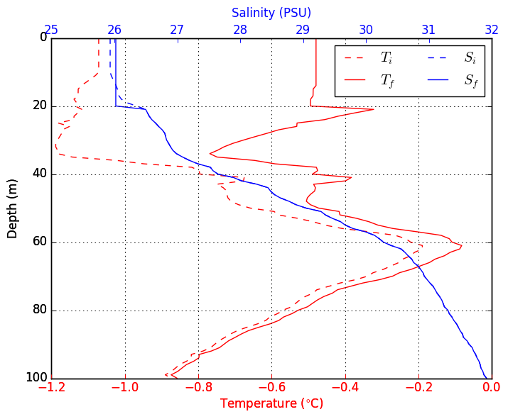
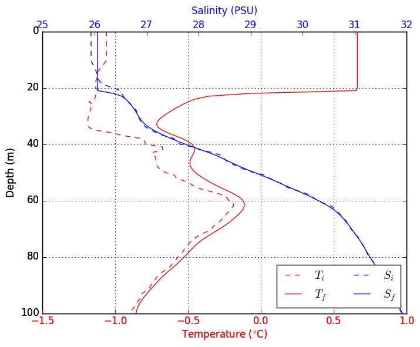

## Description

This is a Python implementation of the Price Weller Pinkel ([PWP](https://hycom.org/attachments/067_pwp.pdf)) ocean mixed layer model. This code is based on the MATLAB implementation of the PWP model originally written by [Peter Lazarevich and Scott Stoermer](http://www.po.gso.uri.edu/rafos/research/pwp/) (U. Rhode Island) and later modified by Byron Kilbourne (University of Washington) and Sarah Dewey (University of Washington).

For a detailed description of the theory behind the model, I would recommend the original [Price et al. (1986)](http://onlinelibrary.wiley.com/doi/10.1029/JC091iC07p08411/full) paper. A much shorter review of the algorithm is provided in the [HYCOM documentation of the PWP](https://hycom.org/attachments/067_pwp.pdf); a google search may yield produce better sources.

The code presented here is functionally similar to its MATLAB equivalent (see *matlab_files/PWP_Byron.m*). However, I have made significant changes to the code organization. One big difference is that this code is split into two files: **PWP.py** and **PWP_helper.py**. 

*PWP.py* contains the core numerical algorithms for the PWP model. This is mostly a line-by-line translation of the original MATLAB code. 
*PWP_helper.py* contains helper functions to facilitate model initialization, output analysis and other miscellaneous tasks. Some of these functions were added with this implementation.

**I did this re-write as a personal exercise and I am still experimenting with the code. I would recommend thoroughly examining this code before adopting it for your personal use.** 

## Input data

The PWP model requires two input files **met.nc** and **profile.nc**. Examples of both are provided in the input directory. These are summertime data from the Beaufort Sea, courtesy of Sarah Dewey. 

**met.nc** is a netCDF file containing the surface data. The expected fields are listed below:

+ **time**: sample time (days).
+ **sw**: net shortwave radiation (W/m<sup>2</sup>)
+ **lw**: net longwave radiation (W/m<sup>2</sup>)
+ **qlat**: latent heat flux (W/m<sup>2</sup>)
+ **qsens**: sensible heat flux (W/m<sup>2</sup>)
+ **tx**: eastward wind stress (N/m<sup>2</sup>)
+ **ty**: northward wind stress (N/m<sup>2</sup>)
+ **precip**: precipitation rate (m/s)

These variables should be 1-D time series (arrays) of the same length, all corresponding to the **time** array. **Positive heat fluxes should represent heat gained by the ocean**. 

The time data field should contain a 1-D array representing fraction of day. For example, for 6 hourly data, met_data['time'] should contain a number series that increases in steps of 0.25, such as np.array([1.0, 1.25, 1.75, 2.0, 2.25...]).

The example *met.nc* file contains 3-hourly surface forcing data over a 28 day period.

**profile.nc** contains the initial profile data. The expected fields are **z**, **t** and **s**, representing depth (m), temperature (degrees celsius), salinity respectively. 

## How the code works

As mentioned earlier, the code is split into two files *PWP.py* and *PWP_helper.py*. Within *PWP.py*, the *run()* function is the main function that controls all the operations. The order of operations is as follows:

1. Set and derive model parameters. (See *set\_params* function in *PWP\_helper.py*). 
2. Prepare forcing and profile data for model run (see *prep\_data* function in *PWP\_helper.py*).
3. Iterate the PWP model:
    + apply heat and salt fluxes.
    + apply wind stress (momentum flux).
    + apply bulk Richardson number mixing
    + apply gradient Richardson number. 
    + apply diapycnal diffusion (if ON).
4. Save results to output file.
5. Make simple plots to visualize the results.    

To get a feel for how this code/model is organized, the `PWP.run()` function would be a good place to start. 

## Running the code

To run the code, you can type `%run PWP.py` from the iPython command line. This calls the `PWP.run()` function. Alternatively, you can import PWP.py as a module then run the model directly:

```
import PWP
PWP.run()
```

This runs the model with the default settings. You can modify the model settings via the `run()` function. For example,

```
p={}
p['rkz'] = 1e-6 #diff coeff.
p['dz'] = 2 #vertical res (m)
p['dt'] = 6 #time step (hrs)
PWP.run(met_data='somewhere_other_forcing.nc', overwrite=False, param_kwds=p )
```

See the documentation for the `set_params()` function in *PWP\_helper.py* for a full list of control parameters. 

## Required modules/libraries
To run this code, you'll need Python 2.7 (some earlier versions might work) and the following libraries:

+ Numpy
+ Scipy
+ Matplotlib
+ [xray](http://xray.readthedocs.org/en/v0.5/why-xray.html)
+ seawater

The first three modules are available with the popular python distributions such as [Anaconda](https://www.continuum.io/downloads) and [Canopy](https://store.enthought.com/downloads/#default). You can get the other two modules via the `pip install` command from the unix command line:

```
pip install xray
pip install seawater
```

Besides the python libraries listed here, this repository should have everything you need to do a model run with the provided datasets.


## Example output

The plots below show the sample surface forcing data stored in the *met.nc*. These data represent summertime surface conditions over the Beaufort Sea.


The plot below compares initial (dashed lines) and final (solid) salinity and temperature profiles. This is with diffusion turned off (i.e. `rkz=0`).



The next plot shows the effect of setting the vertical diffusion co-efficient (`rkz`) to 1x10<sup>-6</sup> m<sup>2</sup>/s.




## Future work
+ Create an option to add a passive tracer to the model.
+ Incorporate a rudimentary sea-ice model to provide ice induced heat and salt fluxes.
