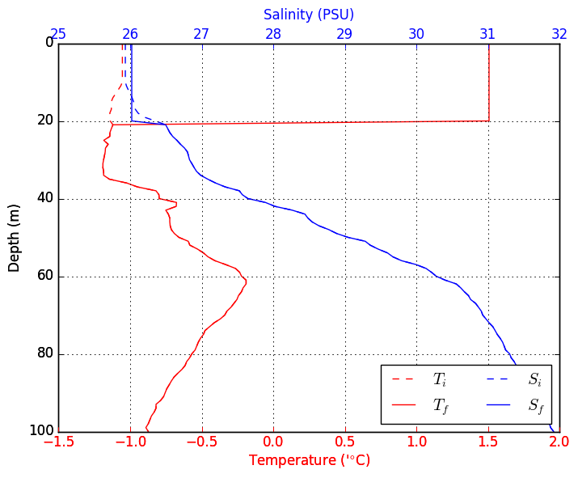

## Description

This is a Python implementation of the Price Weller Pinkel ([PWP](https://hycom.org/attachments/067_pwp.pdf)) ocean mixed layer model. This code is based on the MATLAB implementation of the PWP model written/modified by Byron Kilbourne (University of Washington) and Sarah Dewey (University of Washington).  I did this re-write as a personal exercise, so I would be cautious about using this code to do any serious work. 

The code presented here is functionally similar to *PWP_Byron.m* (see *matlab_files/*). However, I made significant changes to the overall code organization. One big difference is that this code is split into two files. The main file, *PWP.py*, contains the core numerical algorithms for the PWP model. These numerical algorithms are mostly line-by-line translations of their MATLAB equivalents. The second file, *PWP_helper.py*, contains helper functions to facilitate model initialization, output analysis and other miscellaneous tasks. 

To run the code, you can type `%run PWP.py` from the iPython command line. This calls the `PWP.run()` function, which is the main function for the script. Alternatively, you can import PWP.py as a module then run the model directly:

```
import PWP
PWP.run()
```

This approach allows you to modify the model settings and parameters:

```
PWP.run(met_data='somewhere_else.nc', overwrite=False, diagnostics=False)
```

To get a feel for how this code/model is organized, the `PWP.run()` function would be a good place to start. This function has a fairly detailed doc-file, so it should be self-explanatory. 

This repository also contains sample surface forcing and initial profile data files. These are summertime data from the Beaufort Sea, courtesy of Sarah Dewey. If you copy this repository to a local directory, you should be able to run the model immediately - provided you have all the necessary modules.  

This code was written using Python version 2.7.6.

### Example output

The plots below show the sample surface forcing data stored in the *met.nc*. These data represent summertime surface conditions over the Beaufort Sea.


The plot below compares initial (dashed lines) and final (solid) salinity and temperature profiles. These plots are generated by running `PWP.run()` using the default input files and settings.

