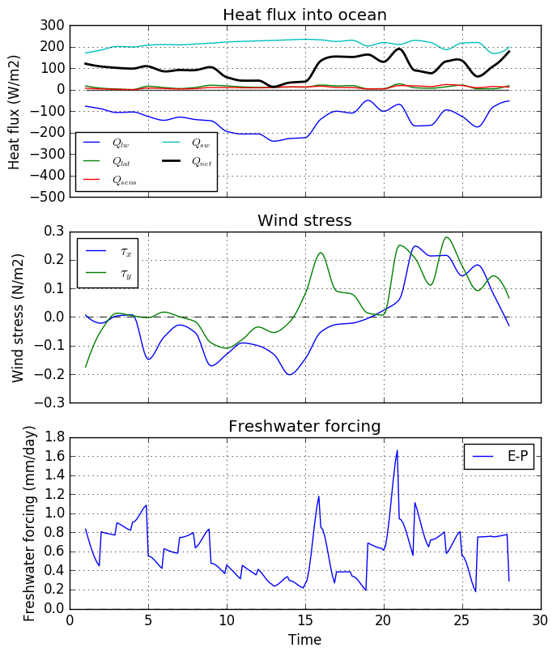
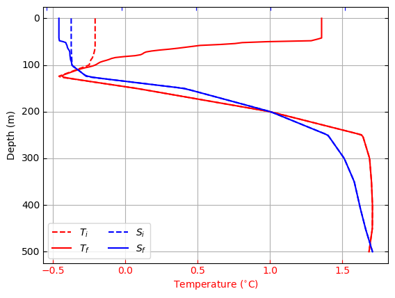

## Description

This is a Python implementation of the Price Weller Pinkel (PWP) ocean mixed layer model. This code is based on the MATLAB verision of the PWP model, originally written by [Peter Lazarevich and Scott Stoermer](http://www.po.gso.uri.edu/rafos/research/pwp/) (U. Rhode Island) and later modified by Byron Kilbourne (University of Washington) and Sarah Dewey (University of Washington).

For a detailed description of the theory behind the model, please review the original [Price et al. (1986)](http://onlinelibrary.wiley.com/doi/10.1029/JC091iC07p08411/full) paper. A much shorter review of the algorithm is provided in the [HYCOM documentation for the PWP](https://hycom.org/attachments/067_pwp.pdf); a google search may yield produce better sources.

The code presented here is functionally similar to its MATLAB equivalent (see *matlab_files/PWP_Byron.m*), but I have made significant changes to the code organization and flow. One big difference is that this code is split into two files: **PWP.py** and **PWP_helper.py**. 

*PWP.py* contains the core numerical algorithms for the PWP model and is mostly a line-by-line translation of the original MATLAB code. 

*PWP_helper.py* contains helper functions to facilitate model initialization, output analysis and other miscellaneous tasks. Many of these functions were introduced in this implementation.

**I did this re-write as a personal exercise and I am still experimenting with the code. I would recommend thoroughly examining this code before adopting it for your personal use.** 

## Required modules/libraries
To run this code, you'll need Python 2.7 (some earlier versions might work) and the following libraries:

+ Numpy
+ Scipy
+ Matplotlib
+ [xray](http://xray.readthedocs.org/en/v0.5/why-xray.html)
+ seawater

The first three modules are available with the popular python distributions such as [Anaconda](https://www.continuum.io/downloads) and [Canopy](https://store.enthought.com/downloads/#default). You can get the other two modules via the `pip install` command from the unix command line:

```
pip install xray
pip install seawater
```

Besides the python libraries listed here, this repository should have everything you need to do a model run with the provided datasets.


## How the code works

As mentioned earlier, the code is split into two files *PWP.py* and *PWP_helper.py*. Within *PWP.py*, the *run()* function is the main function that controls all the operations. The order of operations is as follows:

1. Set and derive model parameters. (See *set\_params* function in *PWP\_helper.py*). 
2. Prepare forcing and profile data for model run (see *prep\_data* function in *PWP\_helper.py*).
3. Iterate the PWP model:
    + apply heat and salt fluxes.
    + apply wind stress (momentum flux).
    + apply bulk Richardson mixing.
    + apply gradient Richardson mixing. 
    + apply drag caused by internal wave dissipation.
    + apply diapycnal diffusion (if ON).
4. Save results to output file.
5. Make simple plots to visualize the results.    

To get a feel for how this code/model is organized, the `PWP.run()` function would be a good place to start. 

## Input data

The PWP model requires two input netCDF files: one for the surface forcing and another for the initial profile. The surface forcing file must have the following data fields:

+ **time**: sample time (days).
+ **sw**: net shortwave radiation (W/m<sup>2</sup>)
+ **lw**: net longwave radiation (W/m<sup>2</sup>)
+ **qlat**: latent heat flux (W/m<sup>2</sup>)
+ **qsens**: sensible heat flux (W/m<sup>2</sup>)
+ **tx**: eastward wind stress (N/m<sup>2</sup>)
+ **ty**: northward wind stress (N/m<sup>2</sup>)
+ **precip**: precipitation rate (m/s)

For the heat fluxes, **positive values should correspond to heat gained by the ocean**. Note that the MATLAB version of this code uses a different sign convention. 

The time data field should contain a 1-D array representing fraction of day. For example, for 6 hourly data, met_data['time'] should contain a number series that increases in steps of 0.25, such as np.array([1.0, 1.25, 1.75, 2.0, 2.25...]).

The initial profile file should have the following data fields:
 
+ **z**: 1-D array of depth levels (m) 
+ **t**: 1-D array containing temperature profile (degrees celsius)
+ **s**: 1-D array containing salinity profile (PSU) 
+ **lat**: float representing latitude of profile

Examples of both input files are provided in the input directory. 

## Running the code

For examples of how to run the code, see the `run_demo1()` and `run_demo2()` functions in *PWP_helper.py*. These examples are also demo-ed in the test runs below.

## Default settings

The main model parameters and their defaults are listed below (see the `set_params()` function in *PWP_helper.py*):

+ **dt**: time-step increment. Input value in units of hours, but this is immediately converted to seconds. [3 hours]
+ **dz**: depth increment (meters). [1m]
+ **max_depth**: Max depth of vertical coordinate (meters). [100]
+ **mld_thresh**: Density criterion for MLD (kg/m3). [1e-4]
+ **dt_save**: time-step increment for saving to file (multiples of dt). [1]
+ **rb**: critical bulk richardson number. [0.65]
+ **rg**: critical gradient richardson number. [0.25]
+ **rkz**: background vertical diffusion (m**2/s). [0.]
+ **beta1**: longwave extinction coefficient (meters) [0.6] 
+ **beta2**: shortwave extinction coefficient (meters). [20]


## Test runs

### Beaufort Sea in the summer
This test case uses data from the default input files, *met_beaufort.nc* and *profile_beaufort.nc*, which contain summertime data<sup>*</sup> from the Beaufort Sea. These example files were kindly provided by Sarah Dewey. The following solutions are generated by doing the following:

```
import PWP
forcing_fname = 'beaufort_met.nc'
prof_fname = 'beaufort_profile.nc'
PWP.run(met_data=forcing_fname, prof_data=prof_fname, save_plots=True)
```

Alternatively, you can run the `run_demo1()` function in *PWP_helper.py*. The first series of plots show the surface fluxes used by the model.



The second plot compares initial (dashed lines) and final (solid) salinity and temperature profiles.


In the default set-up, vertical diffusivity is turned off. We can modify this model parameter via `param_kwds` keyword argument:

```
p={}
p['rkz'] = 1e-6 #diff coeff.
PWP.run(met_data=forcing_fname, prof_data=prof_fname, save_plots=True, param_kwds=p)
```

The effect of setting the vertical diffusion co-efficient (`rkz`) to 1x10<sup>-6</sup> m<sup>2</sup>/s is shown below.


<sup>*</sup> I later realized that this is an unfortunate test case. You will notice that the latent heat flux shown here is positive (i.e. it warms the ocean). This is because it contains a contribution from ice melt. However, **this current implementation of the PWP model is not equipped to handle ice melt/growth. The latent heat flux supplied to the model must only represent the heat flux associated with evaporation**.

### Southern Ocean in the summer
This test case uses data from the default input files, *SO\_met\_30day.nc* and *SO\_profile1.nc*. The *SO\_met\_30day.nc* file contains 6-hourly NCEP reanalysis surface fluxes at -53.5 N and 0.02 E, which is situated in the Atlantic sector of the Southern Ocean - just north of the winter time ice-edge. The *SO_profile1.nc* file contains temperature and salinity profile data at the above location, collected on December 11, 2014. This data is the the first profile from Argo float [5904469](http://www.ifremer.fr/co-argoFloats/float?detail=false&ptfCode=5904469).

The surface forcing time series are shown below.


For this model run, we set the vertical diffusivity to 1x10<sup>-6</sup> m<sup>2</sup>/s, and change the max depth and depth increment to 500m and 2m, respectively:

```
forcing_fname = 'SO_met_30day.nc'
prof_fname = 'SO_profile1.nc'
p={}
p['rkz']=1e-6
p['dz'] = 2.0 
p['max_depth'] = 500.0 
forcing, pwp_out = PWP.run(met_data=forcing_fname, prof_data=prof_fname, save_plots=True, param_kwds=p)
```

The results are displayed below.    



You can repeat this test case by running the `run_demo2()` function in *PWP_helper.py*.


## Future work
+ Create an option to add a passive tracer to the model.
+ Incorporate a rudimentary sea-ice model to provide ice induced heat and salt fluxes.
