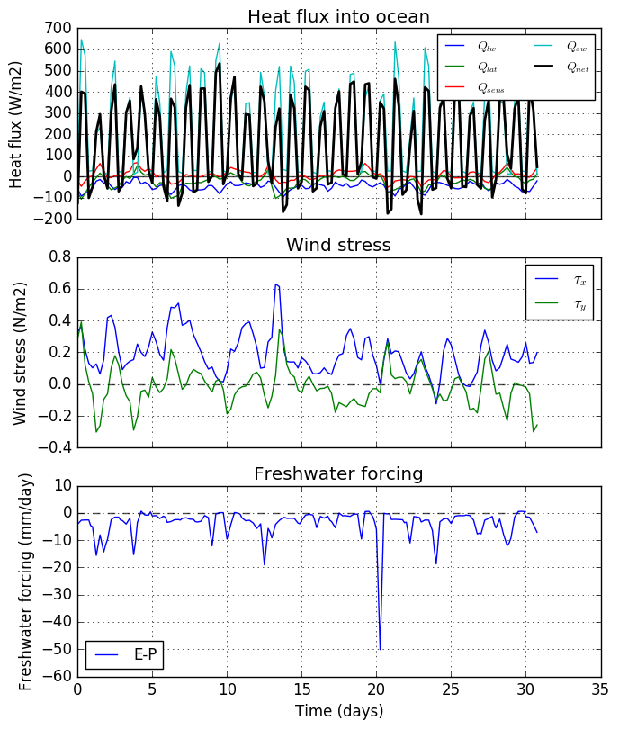
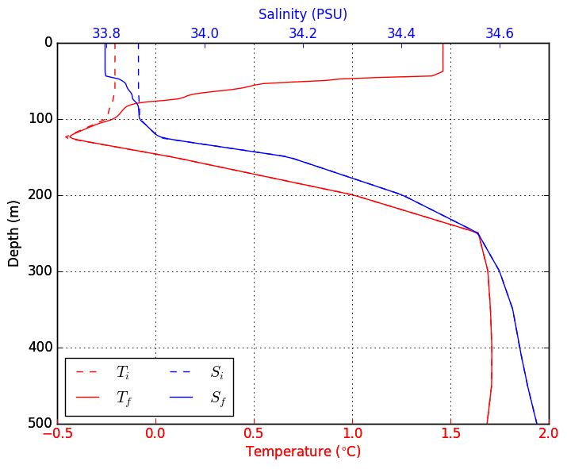
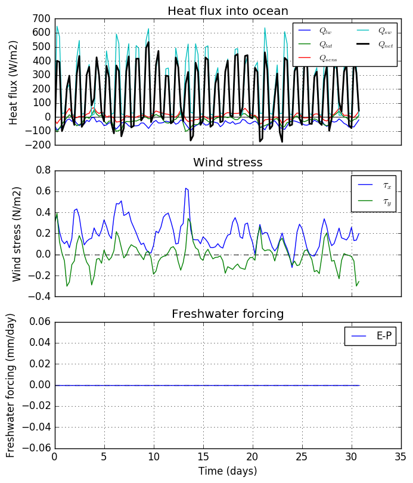
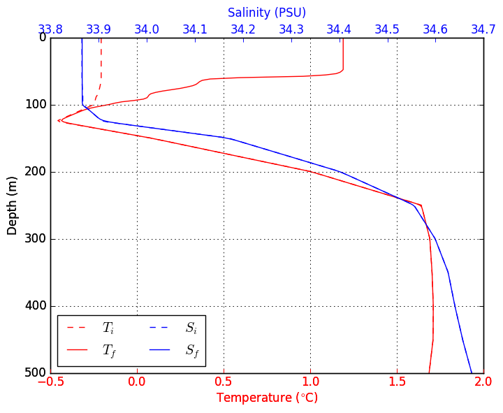
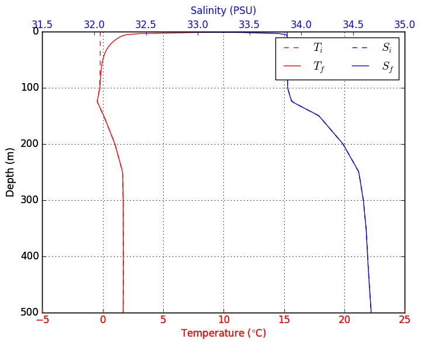

## Description

This is a Python implementation of the Price Weller Pinkel (PWP) ocean mixed layer model. This code is based on the MATLAB verision of the PWP model, originally written by [Peter Lazarevich and Scott Stoermer](http://www.po.gso.uri.edu/rafos/research/pwp/) (U. Rhode Island) and later modified by Byron Kilbourne (University of Washington) and Sarah Dewey (University of Washington).

For a detailed description of the theory behind the model, the best source is the original [Price et al. (1986)](http://onlinelibrary.wiley.com/doi/10.1029/JC091iC07p08411/full) paper that introduced the model. A much shorter review of the algorithm is provided in the [HYCOM documentation for the PWP](https://hycom.org/attachments/067_pwp.pdf); a google search may yield better sources.

The code presented here is functionally similar to its MATLAB equivalent (see *matlab\_files/PWP_Byron.m*), but I have made significant changes to the code organization and flow. One big difference is that this code is split into two files: **PWP.py** and **PWP_helper.py**. 

*PWP.py* contains the core numerical algorithms for the PWP model and is mostly a line-by-line translation of the original MATLAB code. 

*PWP_helper.py* contains helper functions to facilitate model initialization, output analysis and other miscellaneous tasks. Many of these functions were introduced in this implementation.

DISCLAIMER: 
I did this python translation as a personal exercise, so I would recommend thoroughly examining this code before adopting it for your personal use. Feel free to leave a note under the [issues tab](https://github.com/earlew/pwp_python_00/issues) if you encounter any problems.


## Required modules/libraries
To run this code, you'll need Python 3 (might work with later versions of Python 2) and the following libraries:

+ Numpy
+ Scipy
+ Matplotlib
+ [xarray](http://xarray.pydata.org/en/stable/)
+ seawater

The first three modules are available with popular python distributions such as [Anaconda](https://www.continuum.io/downloads) and [Canopy](https://store.enthought.com/downloads/#default). You can get the other two modules via `pip install` from the unix command line:

```
pip install xarray
pip install seawater
```

Once these libraries are installed, you should be able to run the demos that are mentioned below. 

## How the code works

As mentioned above, the code is split across two files *PWP.py* and *PWP_helper.py*. *PWP.py* contains all the numerical algorithms while *PWP_helper.py* has a few auxillary functions. The order of operations is as follows:

1. Set and derive model parameters. (See *set\_params* function in *PWP\_helper.py*). 
2. Prepare forcing and profile data for model run (see *prep\_data* function in *PWP\_helper.py*).
3. Iterate the PWP model:
    + apply heat and salt fluxes.
    + apply wind stress (momentum flux).
    + apply drag associated with internal-inertial wave dispersion.
    + apply bulk Richardson mixing.
    + apply gradient Richardson mixing. 
    + apply diapycnal diffusion (if ON).
4. Save results to an output file.
5. Make simple plots to visualize the results.    

If you wish to obtain a deeper understanding of how this code works, the `PWP.run()` function would be a good place to start. 

## Input data

The PWP model requires two input netCDF files: one for the surface forcing and another for the initial CTD profile. The surface forcing file must have the following data fields:

+ **time**: time (days).
+ **sw**: net shortwave radiation (W/m<sup>2</sup>)
+ **lw**: net longwave radiation (W/m<sup>2</sup>)
+ **qlat**: latent heat flux (W/m<sup>2</sup>)
+ **qsens**: sensible heat flux (W/m<sup>2</sup>)
+ **tx**: eastward wind stress (N/m<sup>2</sup>)
+ **ty**: northward wind stress (N/m<sup>2</sup>)
+ **precip**: precipitation rate (m/s)

For fluxes, **positive values should correspond to heat/freshwater gained by the ocean**. Note that the MATLAB version of this code uses a different sign convention. 

Freshwater flux due to evaporation is computed from **qlat**.

The time data field should contain a 1-D array representing fraction of day. For example, for 6 hourly data, this should be a number series that increases in steps of 0.25, such as np.array([1.0, 1.25, 1.75, 2.0, 2.25...]).

The initial profile file should have the following data fields:
 
+ **z**: 1-D array of depth levels (m) 
+ **t**: 1-D array containing temperature profile (degrees celsius)
+ **s**: 1-D array containing salinity profile (PSU) 
+ **lat**: Array with float representing the latitude of profile. e.g. `prof_data['lat'] = [45] #45N`

Examples of both input files are provided in the input directory. 

## Running the code

For examples of how to run the code, see the `run_demo1()` and `run_demo2()` functions in *PWP_helper.py*. `run_demo2()` is illustrated below.

## Default settings

The main model parameters and their defaults are listed below. See test runs below for examples of how to change these settings:

+ **dt**: time-step increment in units of hours [3 hours]
+ **dz**: depth increment (meters). [1m]
+ **max_depth**: Max depth of vertical coordinate (meters). [100]
+ **mld_thresh**: Density criterion for MLD (kg/m3). [1e-4]
+ **dt_save**: time-step increment for saving to file (multiples of dt). [1]
+ **rb**: critical bulk richardson number. [0.65]
+ **rg**: critical gradient richardson number. [0.25]
+ **rkz**: background vertical diffusion (m**2/s). [0.]
+ **beta1**: longwave extinction coefficient (meters) [0.6] 
+ **beta2**: shortwave extinction coefficient (meters). [20]
+ **winds_ON**: True/False flag to turn ON/OFF wind forcing. [True]
+ **emp_ON**: True/False flag to turn ON/OFF freshwater forcing. [True]
+ **heat_ON**: True/False flag to turn ON/OFF surface heat flux forcing. [True]
+ **drag_ON**: True/False flag to turn ON/OFF current drag due to internal-inertial wave dispersion. [True]


## Test case 1: Southern Ocean in the summer
This example uses data from *SO\_profile1.nc* and *SO\_met\_30day.nc*, which contain the initial profile and surface forcing data respectively. For the initial profile, we use the first profile collected by Argo float [5904469](http://www.ifremer.fr/co-argoFloats/float?detail=false&ptfCode=5904469). This profile was recorded in the Atlantic sector of the Southern Ocean (specifically, -53.5$^{\circ}$ N and 0.02$^{\circ}$ E) on December 11, 2014. For the surface forcing, we use 30 day time series of 6-hourly surface fluxes from [NCEP reanalysis](http://www.esrl.noaa.gov/psd/data/gridded/data.ncep.reanalysis.surfaceflux.html) at the above location. 

To run the demo that uses this data, you can do the following from a Python terminal

```
>>> import PWP_helper
>>> PWP_helper.run_demo2()
```

Doing this will execute the model and generate several plots.

### Run1: Full simulation
The surface forcing time series are shown below.



For this model run, we set the vertical diffusivity to 1x10<sup>-6</sup> m<sup>2</sup>/s, and change the max depth and depth increment to 500m and 2m, respectively:

```
forcing_fname = 'SO_met_30day.nc'
prof_fname = 'SO_profile1.nc'
p={}
p['rkz']=1e-6
p['dz'] = 2.0 
p['max_depth'] = 500.0 
forcing, pwp_out = PWP.run(met_data=forcing_fname, prof_data=prof_fname, save_plots=True, param_kwds=p)
```

The results are displayed below.    



### Run2: Freshwater fluxes off

In this run, everything is the same as the previous example except that the E-P forcing is turned off. To execute this run, you can do

```
>>> PWP_helper.run_demo2(emp_ON=False)
```

The resulting surface forcing is shown below:



This results in the following upper ocean evolution:



As we can see, setting the freshwater flux to zero results in a final mixed layer is slightly deeper, saltier and cooler.

### Run3: Wind forcing off

In this simulation, the wind forcing is turned off. 

```
>>> PWP_helper.run_demo2(winds_ON =False)
```




Without wind-driven mixing, the final mixed layer depth is much shallower than the previous cases.

## Future work
+ Create an option to add a passive tracer to the model.
+ Incorporate a rudimentary sea-ice model to provide ice induced heat and salt fluxes.
